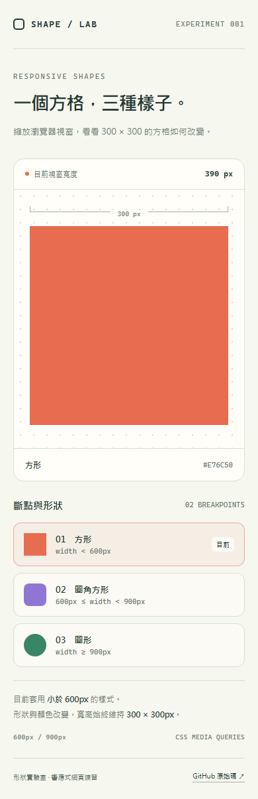
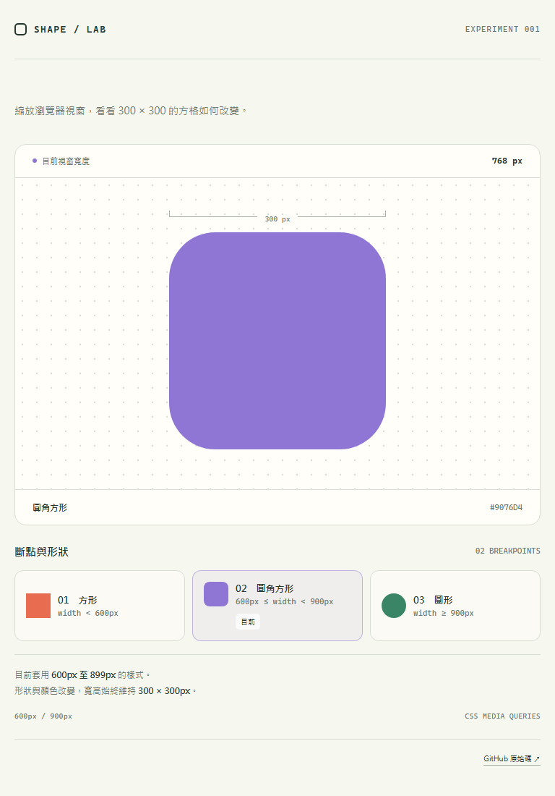
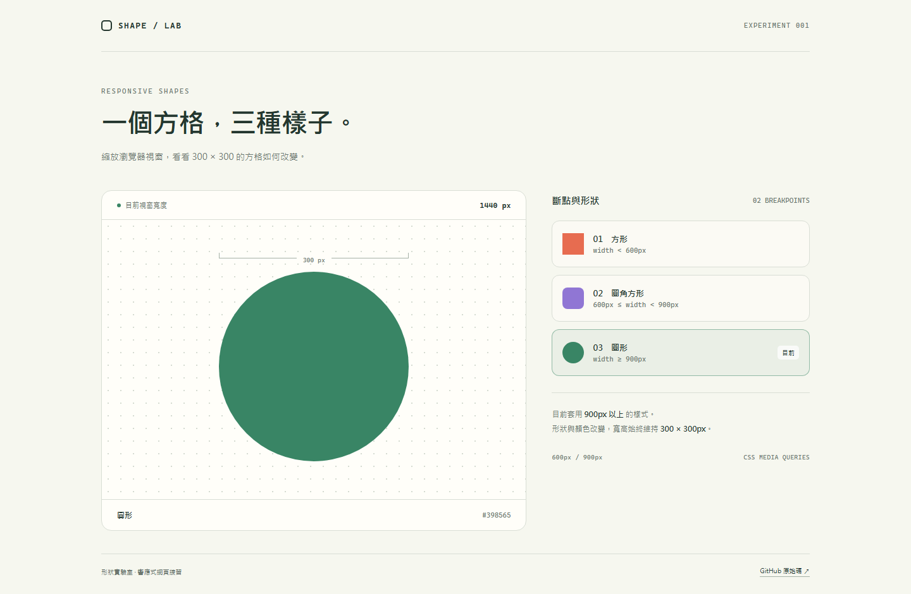

# 300×300 響應式方格

以原生 HTML、CSS 建立的響應式網頁，使用 **600px**、**900px** 兩個斷點。

**展示網址：** https://opchannelyeayo-dotcom.github.io/responsive-shape-lab/

| 視窗寬度 | 形狀 | 顏色 | 尺寸 |
| --- | --- | --- | --- |
| 小於 600px | 方形 | 珊瑚色 `#E76C50` | 300×300px |
| 600px 至小於 900px | 圓角方形（圓角 64px） | 紫色 `#9076D4` | 300×300px |
| 900px 以上 | 圓形 | 綠色 `#398565` | 300×300px |

直接開啟 `index.html` 即可使用。調整瀏覽器視窗寬度會自動改變形狀與顏色；JavaScript 僅更新視窗寬度文字與無障礙描述，形狀變化由 CSS media queries 控制。

## 三種畫面

以下截圖擷取自 GitHub Pages 正式展示網址。

### 390px：珊瑚色方形

### 768px：紫色圓角方形

### 1440px：綠色圓形

